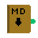

# dk-file-icons README


Basic file icon theme for vscode drawn by me with pixel art. 


                       


# Full Preview 


### Testing Locally via VSIX

1. **Uninstall** any previously installed versions:

   ```bash
   codium --uninstall-extension DavidKozdra.dkpixelart-theme
   ```
2. **Install** the VSCE packaging tool (if you haven’t already):

   ```bash
   npm install -g vsce
   ```
3. **Package** the extension:

   ```bash
   vsce package
   ```

   This generates `dkpixelart-theme-0.0.x.vsix` in the root directory.
4. **Install** the VSIX:

   ```bash
   codium --install-extension dkpixelart-theme-0.0.x.vsix
   ```
5. **Reload** and **Activate**:

   * Press <kbd>Ctrl</kbd>+<kbd>Shift</kbd>+<kbd>P</kbd>, run **Developer: Reload Window**
   * Open **Preferences → File Icon Theme → DK Pixel Art Theme**

---

## Development

1. **Clone the repository**:

   ```bash
   git clone https://github.com/DavidKozdra/VSC_PixelArtTheme.git
   cd VSC_PixelArtTheme
   ```
2. **Install dependencies**:

   ```bash
   npm install
   ```
3. **Add or update icons** in the `icons/` folder.
4. **Adjust** `icon-theme.json` with your new icon mappings.
5. **Bump the version** in `package.json` (e.g., `0.0.x`).
6. **Package & Install**:

   ```bash
   npx vsce package
   codium --install-extension dkpixelart-theme-0.0.x.vsix
   ```
7. **Reload** the editor:

   * <kbd>Ctrl</kbd>+<kbd>Shift</kbd>+<kbd>P</kbd> → **Developer: Reload Window**

---

# Contact

Thanks for checking it out and please feel free to contact me about changes or issues you are having: davidkozdra@gmail.com